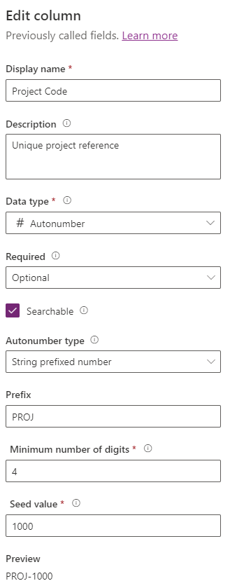
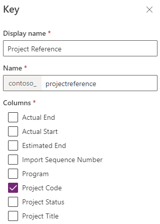
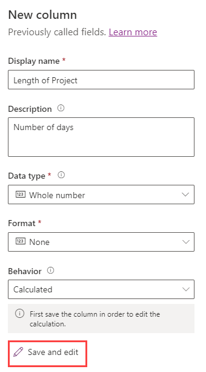
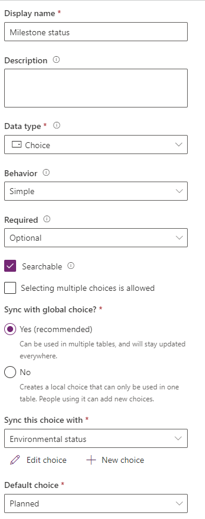
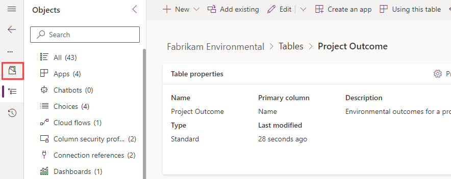

---
lab:
    title: 'Lab 1.5: Columns'
    module: 'Module 1: Work with Microsoft Dataverse'
---

# Practice Lab 1.5 – Columns

## Scenario

You are a Power Platform functional consultant and have been assigned to the Fabrikam project for the next stage of the project.

In this practice lab, you will be modifying the properties of existing table columns and creating a new custom columns.

## Exercise 1 – Modify and add columns on the Project table

In this exercise, you will be changing properties on existing columns on the Project table in the Fabrikam Environmental solution, creating new columns, and adding an alternate key.

### Task 1.1 – Modify properties on existing columns

1. Navigate to the Power Apps Maker portal <https://make.powerapps.com>.

1. Make sure you are in the **Practice** environment.

1. Select **Solutions**.

1. Click to open the **Fabrikam Environmental** solution.

1. In the **Objects** pane on the left, click and expand **Tables**.

1. Select the **Project** table.

1. Under **Schema**, click on **Columns**.

1. Select the **Project Description** column.

1. In the Edit column pane that appears on the right-hand side of the screen, expand **Advanced options** and scroll down.

1. Change the **Maximum character count** to **10000**.

1. Click **Save**.

1. Select the **Project Status** column.

1. In the Edit column pane that appears on the right-hand side of the screen, expand **Advanced options**.

1. Change the **Required** drop-down to **Business required**.

1. Check the **Appears in dashboard's global filter** box.

1. Click **Save**.

1. Select the **Project Type** column.

1. In the Edit column pane that appears on the right-hand side of the screen, expand **Advanced options**.

1. Check the **Appears in dashboard's global filter** box.

1. Click **Save**.

1. Select the **Estimated End** column.

1. In the Edit column pane that appears on the right-hand side of the screen, expand **Advanced options**.

1. Verify that the **Format** is **Date only**.

1. Verify that the  **Time zone adjustment** is **User local**.

1. Check the **Sortable** box.

1. Click **Save**.

### Task 1.2 – Create an auto number column

1. Click **+ New column**.

1. Enter **Project Code** for **Display Name**.

1. Enter **Unique project reference** for **Description**.

1. Select **Autonumber** in the **Data type** drop-down.

1. Enter **PROJ** for **Prefix**.

1. Click **Save**.

    

### Task 1.3 – Add an alternate key

1. In the **Objects** pane on the left, expand **Tables**, and select **Project**.

1. Under **Schema**, click on **Keys**.

1. Click **+ New key**.

1. Enter **Project Reference** for **Display Name**.

1. Check the **Project Code** box

1. Click **Save**.

    

### Task 1.4 – Add a calculated column

1. In the **Objects** pane on the left, expand **Tables**, and select **Project**.

1. Under **Schema**, click on **Columns**.

1. Click **+ New column**.

1. Enter **Length of Project** for **Display Name**.

1. Enter **Number of days** for **Description**.

1. Select **Number** in the **Data type** drop-down. The Data type will be set to Whole Number and the Format will be set to None.

1. Change the **Behavior** drop-down to **Calculated**.

1. Click on **Save and edit**.

    

    > NOTE: You may need to disable the pop-up blocker in your browser and edit the Length of Project column again.

1. When a new browser window opens, click **+ Add condition**.

1. Select **Scheduled Start** for **Field**.

1. Select **Contains data** for **Operator**.

1. Click the green check mark.

    > NOTE: You may need to resize the window to see the check mark.

1. Click **+ Add condition**.

1. Select **Estimated End** for **Field**.

1. Select **Contains data** for **Operator**.

1. Click the green check mark.

1. Click **+ Add Action**.

1. Enter the following formula:

    ```DIFFINDAYS(contoso_scheduledstartdate,contoso_estimatedenddate)```

    > NOTE: You can use intellisense to type and select the elements in the formula.

1. Click the blue check mark.

1. Click **SAVE AND CLOSE**.

    

## Exercise 2 – Modify and add columns on the Project Funding table

In this exercise, you will be changing properties on existing columns on the Project Funding table in the Fabrikam Environmental solution and adding a new column.

### Task 2.1 – Modify value range on an existing column

1. Navigate to the Power Apps Maker portal <https://make.powerapps.com>.

1. Make sure you are in the **Practice** environment.

1. Select **Solutions**.

1. Click to open the **Fabrikam Environmental** solution.

1. In the **Objects** pane on the left, click and expand **Tables**.

1. Select the **Project Funding** table.

1. Under **Schema**, click on **Columns**.

1. Select the **Funding Percentage** column.

1. In the Edit column pane that appears on the right-hand side of the screen, expand **Advanced options** and scroll down.

1. Change the **Minimum value** to **0**.

1. Change the **Maximum value** to **100**.

1. Click **Save**.

### Task 2.2 – Create a currency column

1. Click **+ New column**.

1. Enter **Funding amount** for **Display Name**.

1. Enter **Value of funding from the funder on the project** for **Description**.

1. Select **Currency** in the **Data type** drop-down.

1. Expand **Advanced options** and scroll down.

1. Change the **Minimum value** to **0**.

1. Change the **Maximum value** to **99999999** (Eight 9's).

1. Click **Save**.

## Exercise 3 – Modify a lookup column on the Milestone table

In this exercise, you will be changing properties on a lookup column on the Milestone table in the Fabrikam Environmental solution. Lookup columns when created by a relationship do not have auditing enabled by default.

### Task 3.1 – Modify audit on lookup column

1. Navigate to the Power Apps Maker portal <https://make.powerapps.com>.

1. Make sure you are in the **Practice** environment.

1. Select **Solutions**.

1. Click to open the **Fabrikam Environmental** solution.

1. In the **Objects** pane on the left, click and expand **Tables**.

1. Select the **Milestone** table.

1. Under **Schema**, click on **Columns**.

1. Select the **Project** column.

1. In the Edit column pane that appears on the right-hand side of the screen, expand **Advanced options** and scroll down.

1. Change the **Required** drop-down to **Business required**.

1. Check the **Enable auditing** box.

1. Click **Save**.

## Exercise 4 – Add a choice column

In this exercise, you will be creating a choice column to replace the use of status reasons on the Milestone and Outcome tables.

> NOTE: Status reasons cannot be changed in an editable grid.

### Task 4.1 – Create choice

1. Navigate to the Power Apps Maker portal <https://make.powerapps.com>.

1. Make sure you are in the **Practice** environment.

1. Select **Solutions**.

1. Click to open the **Fabrikam Environmental** solution.

1. In the **Objects** pane on the left, click **Choices**

1. Click **+ New**, select **More**, and then select **Choice**.

1. Enter **Environmental status** for **Display Name**.

1. Enter **Planned** for **Label**

1. Click **+ New choice**.

1. Enter **On Schedule** for **Label**

1. Click **+ New choice**.

1. Enter **Delayed** for **Label**

1. Click **+ New choice**.

1. Enter **Completed** for **Label**

1. Click **+ New choice**.

1. Enter **Cancelled** for **Label**

1. Click **Save**.

    

### Task 4.2 – Add choice to Milestone table

1. In the **Objects** pane on the left, click and expand **Tables**.

1. Select the **Milestone** table.

1. Under **Schema**, click on **Columns**.

1. Click **+ New column**.

1. Enter **Milestone status** for **Display Name**.

1. Select **Choice** in the **Data type** drop-down and then select **Choice** again.

1. Select **Environmental status** in the **Sync this choice with** drop-down.

1. Select **Planned** in the **Default choice** drop-down.

1. Click **Save**.

    

### Task 4.3 – Add choice to Outcome table

1. In the **Objects** pane on the left, click and expand **Tables**.

1. Select the **Outcome** table.

1. Under **Schema**, click on **Columns**.

1. Click **+ New column**.

1. Enter **Outcome status** for **Display Name**.

1. Select **Choice** in the **Data type** drop-down and then select **Choice** again.

1. Select **Environmental status** in the **Sync this choice with** drop-down.

1. Select **Planned** in the **Default choice** drop-down.

1. Click **Save**.

## Exercise 5 – Create columns on the Project Outcome table

In this exercise, you will be creating columns on the Project Outcome custom table that you created in an earlier lab.

### Task 5.1 – Create columns

1. Navigate to the Power Apps Maker portal <https://make.powerapps.com>.

1. Make sure you are in the **Practice** environment.

1. Select **Solutions**.

1. Click to open the **Fabrikam Environmental** solution.

1. In the **Objects** pane on the left, click and expand **Tables**.

1. Select the **Project Outcome** table.

1. Click **+ New**, and then select **Column**.

1. Enter **Stakeholders notified** for **Display Name**.

1. Select **Choice** in the **Data type** drop-down and then select **Yes/No**.

1. Click **Save**.

1. Click **+ New**, and then select **Column**.

1. Enter **Outcome completed date** for **Display Name**.

1. Select **Date and time** in the **Data type** drop-down and then select **Date only**.

1. Click **Save**.

1. Click **+ New**, and then select **Column**.

1. Enter **Comments** for **Display Name**.

1. Select **Text** in the **Data type** drop-down and then under **Multiple lines of text** select  **Plain text**.

1. Click **Save**.

### Task 5.2 – Publish changes

1. In the solution select the **Overview** page.

    

1. Click on **Publish all customizations**.
